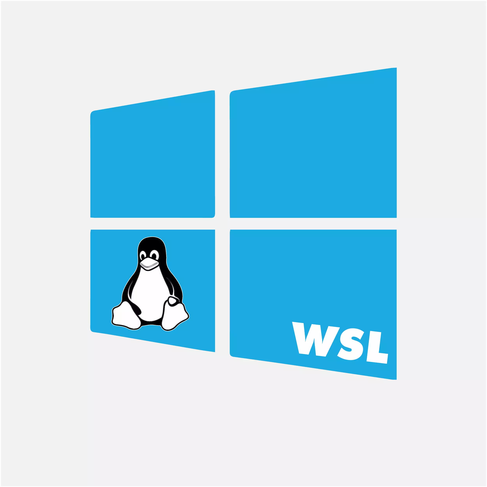

## Welcome
I'm just a person trying to be an open source teamplayer, primary in Python-related fields, such as Django and Flask.

### What I done so far
Everything I done are self taught using official documents and tutorial, such as [Flask Mega-Tutorial](https://blog.miguelgrinberg.com/post/the-flask-mega-tutorial-part-i-hello-world) and [Automate the Boring Stuff with Python](https://automatetheboringstuff.com/2e/chapter0/).

 
 
 
 
 
 
 
 
 
 
 
 
 
 

