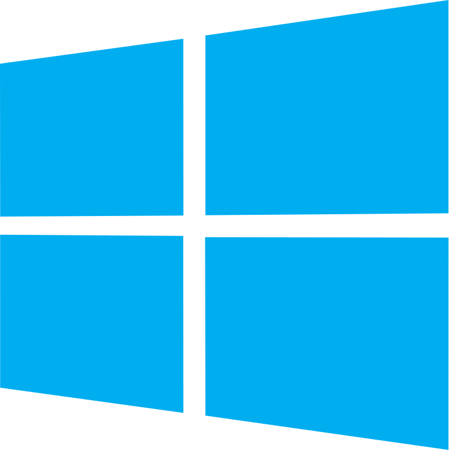
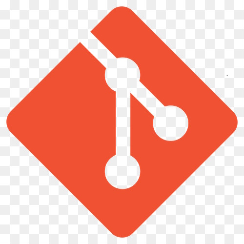
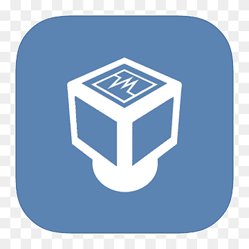
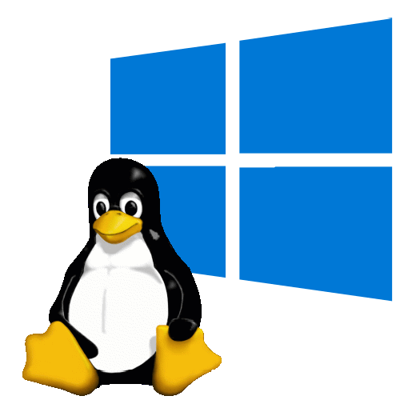

## Welcome everyone
I'm just a person trying to be an open source teamplayer, primary in Python-related fields, such as Django and Flask frameworks.

### What have I done so far?
Everything I learned are all self-taught using official documents and tutorials. To name a few that I liked are: 
- 📣 [Flask Mega-Tutorial](https://blog.miguelgrinberg.com/post/the-flask-mega-tutorial-part-i-hello-world)
- ⚙ [Automate the Boring Stuff with Python](https://automatetheboringstuff.com/2e/chapter0/)

Tools and programing languages that I been using: 

 
 
 
 
 
 
 
 
 
 
 
 
 

